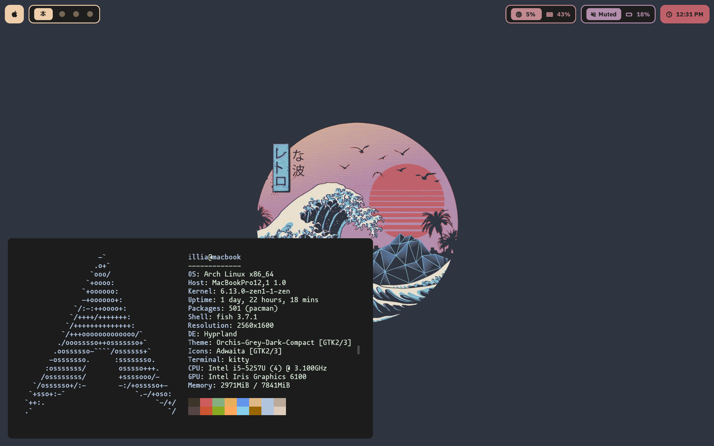

# Dotfiles for Yabai experience

This repository contains dotfiles for the Hyprland + waybar setup, which looks similar to what can be done with Yabai. It is needed for those people (like myself)who have Macbooks with Linux installed, but look for Mac OS like experience.

